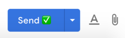
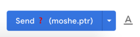
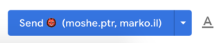

# Safe Send Email - Chrome Extension

This extension is designed to assist is making less mistakes when working in gmail for business.

Common such mistakes includes:

* Unknowingly sending mail outside of your domain (gmail will only warn if the user does not already present in your contacts).
* Mixing up mails to multiple contacts from multiple companies.

The implementation is based on the gmail JavaScript client - [gmail.js](https://github.com/KartikTalwar/gmail.js) 

## Installation

[Chrome Store
](https://chrome.google.com/webstore/detail/safer-send-button/megjllekamffilchcicgdgmfeimicebh)

## The Solution

The send button will be updated to include an emoji inticating one of the three cases:

1. All recipients are from the current domain.

2. Recipients includes external domains.

3. Recipients includes multiple external domains

## Activation

The extension will become active only on a `https://mail.google.com/*` domain.
No analytics or any external calls are being made.

## License
MIT

