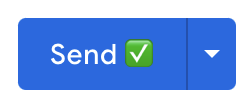
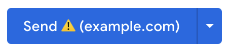
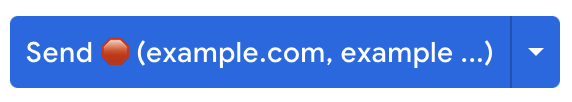

# Safe Send Email - Chrome Extension

Reduce accidental sends and data leakage with the "Safe Send" button for Gmail.
This extension is designed to alert the sender when an email is drafted, by showing dynamic emojis when working in Gmail for Business.

Avoid common mistakes such as: 

1. Unknowingly sending an email outside of your domain or organization (Gmail will only warn if the recipient is not already in your contacts, which most of us don't remember to use)
2. Mixing up mails to multiple contacts from multiple companies - avoid that 'Oops, I cc'd the wrong Tony'

The implementation is based on the gmail JavaScript client - [gmail.js](https://github.com/KartikTalwar/gmail.js) 

## Installation

[Chrome Store
](https://chrome.google.com/webstore/detail/safer-send-button/megjllekamffilchcicgdgmfeimicebh)

## The Solution

The send button will be updated to include an emoji inticating one of the three cases:

1. All recipients are from the current domain.

2. Recipients includes external domains.

3. Recipients includes multiple external domains

## Options

The extension offers the following options:

* Randomize: If checked, the displayed emoji will be randomized to increase user attention (default: false)

## Activation

The extension will become active only on a `https://mail.google.com/*` domain.
No analytics or any external calls are being made.

## License
MIT

